# Class 9 Halloween Candy

In today’s class we will examine some data about candy from the 538
website

## Import Data

## Data exploration

> Q1 How many different candy types are in the dataset

``` r
candy_file <- url("https://raw.githubusercontent.com/fivethirtyeight/data/master/candy-power-ranking/candy-data.csv")

candy = read.csv(candy_file, row.names=1)
head(candy)
```

                 chocolate fruity caramel peanutyalmondy nougat crispedricewafer
    100 Grand            1      0       1              0      0                1
    3 Musketeers         1      0       0              0      1                0
    One dime             0      0       0              0      0                0
    One quarter          0      0       0              0      0                0
    Air Heads            0      1       0              0      0                0
    Almond Joy           1      0       0              1      0                0
                 hard bar pluribus sugarpercent pricepercent winpercent
    100 Grand       0   1        0        0.732        0.860   66.97173
    3 Musketeers    0   1        0        0.604        0.511   67.60294
    One dime        0   0        0        0.011        0.116   32.26109
    One quarter     0   0        0        0.011        0.511   46.11650
    Air Heads       0   0        0        0.906        0.511   52.34146
    Almond Joy      0   1        0        0.465        0.767   50.34755

``` r
nrow(candy)
```

    [1] 85

There are 85 different types of candy in this dataset

> Q2 How many fruity candy types are in the dataset

``` r
sum(candy$fruity)
```

    [1] 38

``` r
candy["Snickers",]$winpercent
```

    [1] 76.67378

``` r
candy["Warheads",]$winpercent
```

    [1] 39.0119

> Q3. What is your favorite candy in the dataset and what is it’s
> winpercent value?

``` r
candy["Milky Way",]$winpercent
```

    [1] 73.09956

> Q4. What is the winpercent value for “Kit Kat”?

``` r
candy["Kit Kat",]$winpercent
```

    [1] 76.7686

> Q5. What is the winpercent value for “Tootsie Roll Snack Bars”?

``` r
candy["Tootsie Roll Snack Bars",]$winpercent
```

    [1] 49.6535

> Q6. Is there any variable/column that looks to be on a different scale
> to the majority of the other columns in the dataset?

The sugar percent, price percent, and winpercent are not just 0’s and
one’s because they are not either true or false values, they are
measurable. The mean, sd, and histogram columns are also different for
the same reason, they are all measurable values

> Q7. What do you think a zero and one represent for the
> candy\$chocolate column?

Zero means chocolate isnt contained in the candy while 1 means that it
is

> Q8. Plot a histogram of win_percent values

``` r
hist(candy$winpercent)
```

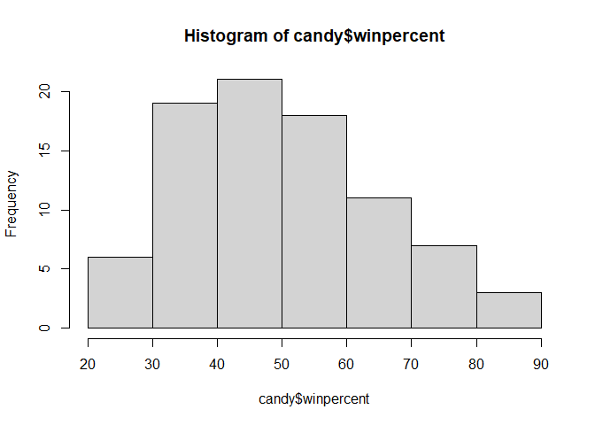

``` r
library(ggplot2)
```

``` r
ggplot(candy) +
  aes(winpercent) +
  geom_histogram(bins=7)
```

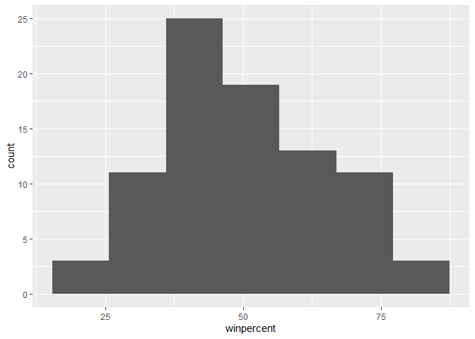

> Q9. Is the distribution of winpercent values symmetrical?

``` r
mean(candy$winpercent)
```

    [1] 50.31676

The distribution is skewed slightly to the right, shown by both the
histogram and the fact that the mean is slightly above 50% which should
theoretically be the middle

> Q10. Is the center of the distribution above or below 50%?

``` r
summary(candy$winpercent)
```

       Min. 1st Qu.  Median    Mean 3rd Qu.    Max. 
      22.45   39.14   47.83   50.32   59.86   84.18 

The center is above 50, but if you look at the median (outlier influence
decreased) then it is below 50.

> Q11. On average is chocolate candy higher ot lower ranked than fruit
> candy?

- first find all chocolate candy
- find their winpercent values
- calculate the mean of these values

-then do the same for the fruity candy and compare with the mean for
chocolate candy

For chocolate

``` r
chocolate.inds <- candy$chocolate == 1
chocolate.win <- candy[chocolate.inds,]$winpercent
mean(chocolate.win)
```

    [1] 60.92153

For fruity

``` r
fruity.inds <- candy$fruity == 1
fruity.win <- candy[fruity.inds,]$winpercent
mean(fruity.win)
```

    [1] 44.11974

Chocolate is generally ranked higher than fruity candy

> Q12.

``` r
t.test(chocolate.win, fruity.win)
```


        Welch Two Sample t-test

    data:  chocolate.win and fruity.win
    t = 6.2582, df = 68.882, p-value = 2.871e-08
    alternative hypothesis: true difference in means is not equal to 0
    95 percent confidence interval:
     11.44563 22.15795
    sample estimates:
    mean of x mean of y 
     60.92153  44.11974 

> Q13. What are the five least liked candy types in this set?

``` r
x <- c(5,6,4)
sort(x)
```

    [1] 4 5 6

``` r
x[order(x)]
```

    [1] 4 5 6

The order function returns the indices that make the input sorted.

``` r
inds <- order(candy$winpercent)
head(candy[inds,])
```

                       chocolate fruity caramel peanutyalmondy nougat
    Nik L Nip                  0      1       0              0      0
    Boston Baked Beans         0      0       0              1      0
    Chiclets                   0      1       0              0      0
    Super Bubble               0      1       0              0      0
    Jawbusters                 0      1       0              0      0
    Root Beer Barrels          0      0       0              0      0
                       crispedricewafer hard bar pluribus sugarpercent pricepercent
    Nik L Nip                         0    0   0        1        0.197        0.976
    Boston Baked Beans                0    0   0        1        0.313        0.511
    Chiclets                          0    0   0        1        0.046        0.325
    Super Bubble                      0    0   0        0        0.162        0.116
    Jawbusters                        0    1   0        1        0.093        0.511
    Root Beer Barrels                 0    1   0        1        0.732        0.069
                       winpercent
    Nik L Nip            22.44534
    Boston Baked Beans   23.41782
    Chiclets             24.52499
    Super Bubble         27.30386
    Jawbusters           28.12744
    Root Beer Barrels    29.70369

``` r
tail(candy[inds,])
```

                              chocolate fruity caramel peanutyalmondy nougat
    Reese's pieces                    1      0       0              1      0
    Snickers                          1      0       1              1      1
    Kit Kat                           1      0       0              0      0
    Twix                              1      0       1              0      0
    Reese's Miniatures                1      0       0              1      0
    Reese's Peanut Butter cup         1      0       0              1      0
                              crispedricewafer hard bar pluribus sugarpercent
    Reese's pieces                           0    0   0        1        0.406
    Snickers                                 0    0   1        0        0.546
    Kit Kat                                  1    0   1        0        0.313
    Twix                                     1    0   1        0        0.546
    Reese's Miniatures                       0    0   0        0        0.034
    Reese's Peanut Butter cup                0    0   0        0        0.720
                              pricepercent winpercent
    Reese's pieces                   0.651   73.43499
    Snickers                         0.651   76.67378
    Kit Kat                          0.511   76.76860
    Twix                             0.906   81.64291
    Reese's Miniatures               0.279   81.86626
    Reese's Peanut Butter cup        0.651   84.18029

Nik L Nip, Boston Bakes Beans, Chiclets, Super Bubble, and Jawbusters
are the 5 least liked (having the lowest winpercents)

``` r
ggplot(candy)+ 
  aes(winpercent, rownames(candy))+
  geom_col()
```

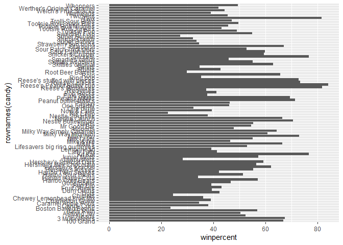

``` r
library(ggplot2)

#| fig-height: 10
#| fig-width: 7

ggplot(candy) + 
  aes(winpercent, reorder(rownames(candy), winpercent)) +
  geom_col()
```


``` r
ggsave("mybarplot.png", height=10)
```

    Saving 7 x 10 in image

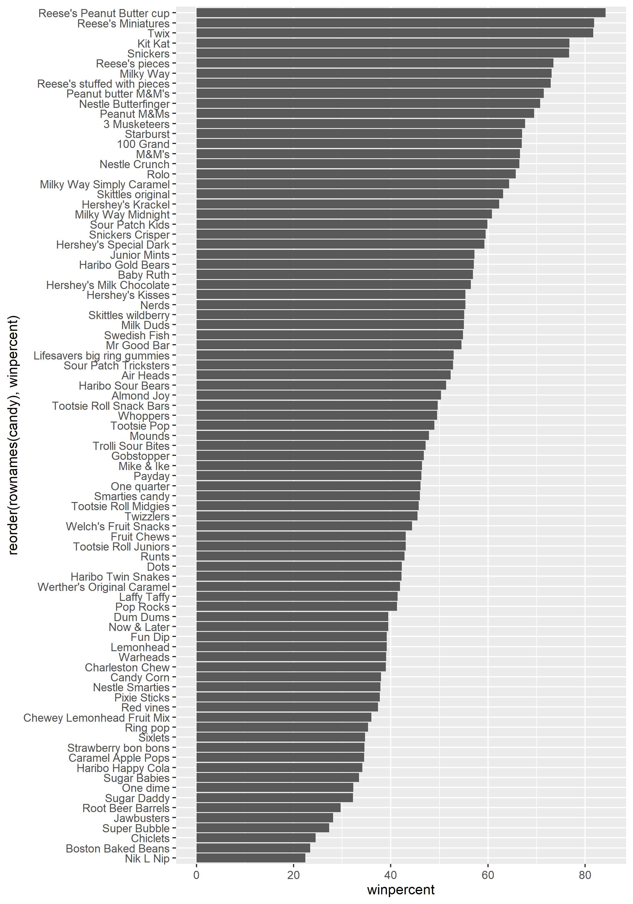

Add my custom colors to my barplot

``` r
my_cols=rep("gray", nrow(candy))
my_cols[candy$fruity == 1] <- "pink"
my_cols[candy$chocolate == 1] <- "brown"
my_cols[candy$bar == 1] <- "black"
my_cols
```

     [1] "black" "black" "gray"  "gray"  "pink"  "black" "black" "gray"  "gray" 
    [10] "pink"  "black" "pink"  "pink"  "pink"  "pink"  "pink"  "pink"  "pink" 
    [19] "pink"  "gray"  "pink"  "pink"  "brown" "black" "black" "black" "pink" 
    [28] "brown" "black" "pink"  "pink"  "pink"  "brown" "brown" "pink"  "brown"
    [37] "black" "black" "black" "black" "black" "pink"  "black" "black" "pink" 
    [46] "pink"  "black" "brown" "gray"  "pink"  "pink"  "brown" "brown" "brown"
    [55] "brown" "pink"  "brown" "gray"  "pink"  "brown" "pink"  "pink"  "brown"
    [64] "pink"  "black" "black" "pink"  "pink"  "pink"  "pink"  "gray"  "gray" 
    [73] "pink"  "pink"  "brown" "brown" "brown" "black" "pink"  "black" "pink" 
    [82] "pink"  "pink"  "gray"  "brown"

``` r
ggplot(candy) + 
  aes(winpercent, reorder(rownames(candy), winpercent)) +
  geom_col(fill=my_cols)
```

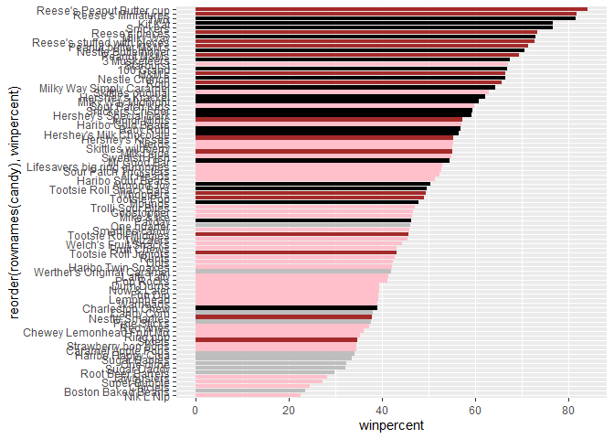

Q17. What is the worst ranked chocolate candy? - Q18. What is the best
ranked fruity candy?

Plot of winpercent vs pricepercent

``` r
ggplot(candy) +
  aes(winpercent, pricepercent, label=rownames(candy)) +
  geom_point(col=my_cols) +
  geom_text(col=my_cols)
```

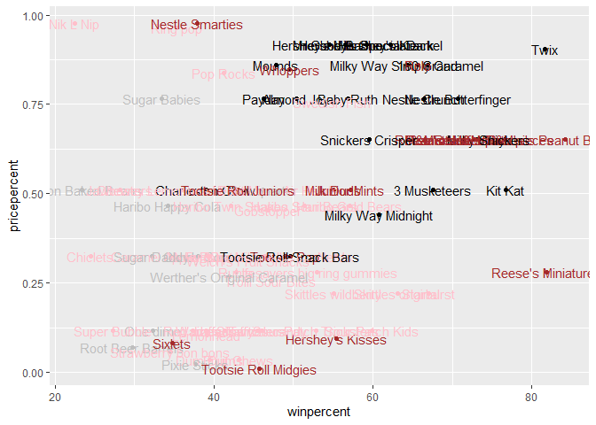

There are just too many labels in this above plot to be readable. We can
use the `ggrepel` package to do a better job of placing labels so they
minimize text overlap

``` r
library(ggrepel)

ggplot(candy) +
  aes(winpercent, pricepercent, label = rownames(candy)) +
  geom_point(col=my_cols) +
  geom_text_repel(col=my_cols, max.overlaps = 7)
```

    Warning: ggrepel: 43 unlabeled data points (too many overlaps). Consider
    increasing max.overlaps

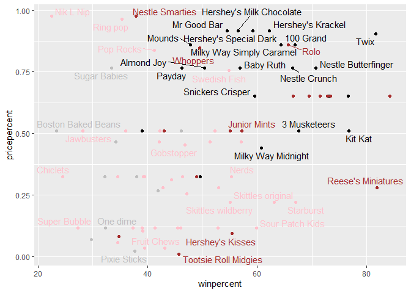

## Exploring the correlation structure

``` r
library(corrplot)
```

    corrplot 0.92 loaded

``` r
cij <- cor(candy)
cij
```

                      chocolate      fruity     caramel peanutyalmondy      nougat
    chocolate         1.0000000 -0.74172106  0.24987535     0.37782357  0.25489183
    fruity           -0.7417211  1.00000000 -0.33548538    -0.39928014 -0.26936712
    caramel           0.2498753 -0.33548538  1.00000000     0.05935614  0.32849280
    peanutyalmondy    0.3778236 -0.39928014  0.05935614     1.00000000  0.21311310
    nougat            0.2548918 -0.26936712  0.32849280     0.21311310  1.00000000
    crispedricewafer  0.3412098 -0.26936712  0.21311310    -0.01764631 -0.08974359
    hard             -0.3441769  0.39067750 -0.12235513    -0.20555661 -0.13867505
    bar               0.5974211 -0.51506558  0.33396002     0.26041960  0.52297636
    pluribus         -0.3396752  0.29972522 -0.26958501    -0.20610932 -0.31033884
    sugarpercent      0.1041691 -0.03439296  0.22193335     0.08788927  0.12308135
    pricepercent      0.5046754 -0.43096853  0.25432709     0.30915323  0.15319643
    winpercent        0.6365167 -0.38093814  0.21341630     0.40619220  0.19937530
                     crispedricewafer        hard         bar    pluribus
    chocolate              0.34120978 -0.34417691  0.59742114 -0.33967519
    fruity                -0.26936712  0.39067750 -0.51506558  0.29972522
    caramel                0.21311310 -0.12235513  0.33396002 -0.26958501
    peanutyalmondy        -0.01764631 -0.20555661  0.26041960 -0.20610932
    nougat                -0.08974359 -0.13867505  0.52297636 -0.31033884
    crispedricewafer       1.00000000 -0.13867505  0.42375093 -0.22469338
    hard                  -0.13867505  1.00000000 -0.26516504  0.01453172
    bar                    0.42375093 -0.26516504  1.00000000 -0.59340892
    pluribus              -0.22469338  0.01453172 -0.59340892  1.00000000
    sugarpercent           0.06994969  0.09180975  0.09998516  0.04552282
    pricepercent           0.32826539 -0.24436534  0.51840654 -0.22079363
    winpercent             0.32467965 -0.31038158  0.42992933 -0.24744787
                     sugarpercent pricepercent winpercent
    chocolate          0.10416906    0.5046754  0.6365167
    fruity            -0.03439296   -0.4309685 -0.3809381
    caramel            0.22193335    0.2543271  0.2134163
    peanutyalmondy     0.08788927    0.3091532  0.4061922
    nougat             0.12308135    0.1531964  0.1993753
    crispedricewafer   0.06994969    0.3282654  0.3246797
    hard               0.09180975   -0.2443653 -0.3103816
    bar                0.09998516    0.5184065  0.4299293
    pluribus           0.04552282   -0.2207936 -0.2474479
    sugarpercent       1.00000000    0.3297064  0.2291507
    pricepercent       0.32970639    1.0000000  0.3453254
    winpercent         0.22915066    0.3453254  1.0000000

``` r
corrplot(cij)
```


> Q22. Examining this plot what two variables are anti-correlated
> (i.e. have minus values)?

chocolate and fruity b/c red dot

> Q23. Similarly, what two variables are most positively correlated?

chocolate ad bar b/c blue dot

## 6. Principal Coponent Analysis

We will perform a PCA of the candy. Key-question: do ween need to scale
the data before PCA?

``` r
pca <- prcomp(candy, scale=T)
summary(pca)
```

    Importance of components:
                              PC1    PC2    PC3     PC4    PC5     PC6     PC7
    Standard deviation     2.0788 1.1378 1.1092 1.07533 0.9518 0.81923 0.81530
    Proportion of Variance 0.3601 0.1079 0.1025 0.09636 0.0755 0.05593 0.05539
    Cumulative Proportion  0.3601 0.4680 0.5705 0.66688 0.7424 0.79830 0.85369
                               PC8     PC9    PC10    PC11    PC12
    Standard deviation     0.74530 0.67824 0.62349 0.43974 0.39760
    Proportion of Variance 0.04629 0.03833 0.03239 0.01611 0.01317
    Cumulative Proportion  0.89998 0.93832 0.97071 0.98683 1.00000

``` r
plot(pca$x[,1], pca$x[,2], col=my_cols, pch=16)
```

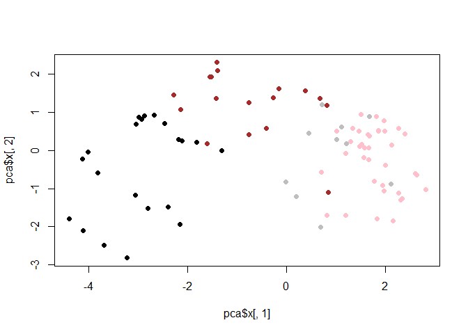

make a ggplot version of this figure:

``` r
# make a new data-frame with our PCA results and candy data
my_data <- cbind(candy, pca$x[,1:3])
head(my_data)
```

                 chocolate fruity caramel peanutyalmondy nougat crispedricewafer
    100 Grand            1      0       1              0      0                1
    3 Musketeers         1      0       0              0      1                0
    One dime             0      0       0              0      0                0
    One quarter          0      0       0              0      0                0
    Air Heads            0      1       0              0      0                0
    Almond Joy           1      0       0              1      0                0
                 hard bar pluribus sugarpercent pricepercent winpercent        PC1
    100 Grand       0   1        0        0.732        0.860   66.97173 -3.8198617
    3 Musketeers    0   1        0        0.604        0.511   67.60294 -2.7960236
    One dime        0   0        0        0.011        0.116   32.26109  1.2025836
    One quarter     0   0        0        0.011        0.511   46.11650  0.4486538
    Air Heads       0   0        0        0.906        0.511   52.34146  0.7028992
    Almond Joy      0   1        0        0.465        0.767   50.34755 -2.4683383
                        PC2        PC3
    100 Grand    -0.5935788 -2.1863087
    3 Musketeers -1.5196062  1.4121986
    One dime      0.1718121  2.0607712
    One quarter   0.4519736  1.4764928
    Air Heads    -0.5731343 -0.9293893
    Almond Joy    0.7035501  0.8581089

``` r
ggplot(my_data) +
  aes(PC1, PC2, label=rownames(my_data)) + 
  geom_point(col=my_cols) +
  geom_text_repel(col=my_cols)
```

    Warning: ggrepel: 25 unlabeled data points (too many overlaps). Consider
    increasing max.overlaps

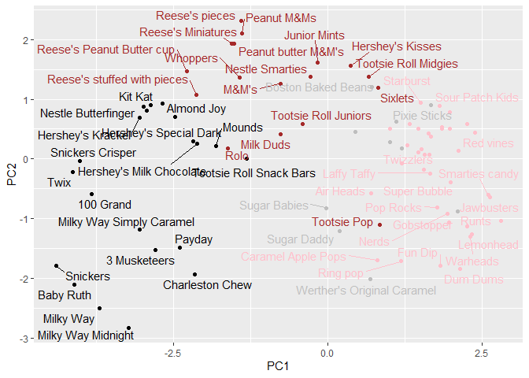

Make this a bit nicer

``` r
p <- ggplot(my_data) + 
        aes(x=PC1, y=PC2, 
            size=winpercent/100,  
            text=rownames(my_data),
            label=rownames(my_data)) +
        geom_point(col=my_cols)
p
```

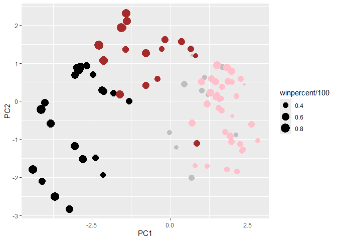

``` r
library(ggrepel)

p + geom_text_repel(size=3.3, col=my_cols, max.overlaps = 7)  + 
  theme(legend.position = "none") +
  labs(title="Halloween Candy PCA Space",
       subtitle="Colored by type: chocolate bar (dark brown), chocolate other (light brown), fruity (red), other (black)",
       caption="Data from 538")
```

    Warning: ggrepel: 43 unlabeled data points (too many overlaps). Consider
    increasing max.overlaps

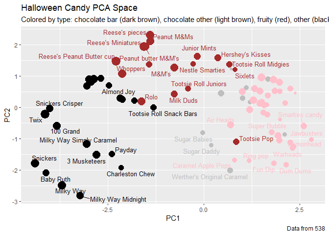

``` r
#library(plotly)

#ggplotly(p)
```

How do the original variable contribute to our PCs\> For this we look at
the loadings component of our results object i.e the `pca$rotation`
object?

Make a barplot with ggplot and order the bars by their value. Recall
that you need a data.frame as input for ggplot

``` r
res <- as.data.frame(pca$rotation)

ggplot(res) +
  aes(x=PC1, row.names(res)) +
  geom_col()
```

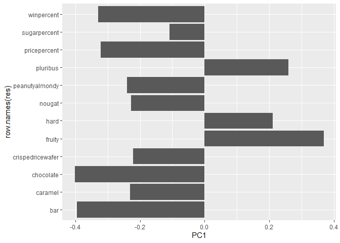

> Q24. What original variables are picked up strongly by PC1 in the
> positive direction? Do these make sense to you?

Fruit, pluribus, and hard are all picked up in the +ve direction and
these do make sense based on the correlation structure in the dataset.
